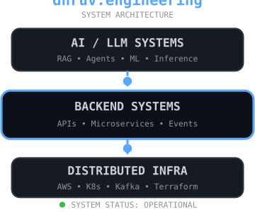

<div align="center">

# `dhruv@github:~$ whoami`

# Hi 👋, I'm Dhruv Patel

### Software Engineer · AI Systems · Distributed Systems · Cloud Infrastructure


<br>

[](https://www.linkedin.com/in/dhruv2211patel/)
[](https://github.com/Dhruv2211patel)


</div>

---
## `$ cat /etc/dhruv`

<table width="100%">
<tr>

<td width="55%" valign="top">

<strong>role:</strong> Software Engineer<br><br>

<strong>specialization:</strong><br>
&nbsp;&nbsp;↳ Backend & Distributed Systems<br>
&nbsp;&nbsp;↳ AI / ML Systems Engineering<br>
&nbsp;&nbsp;↳ Cloud Infrastructure<br>
&nbsp;&nbsp;↳ LLM & Agentic Systems<br><br>

<strong>building:</strong><br>
&nbsp;&nbsp;↳ production AI infrastructure<br>
&nbsp;&nbsp;↳ scalable backend services<br>
&nbsp;&nbsp;↳ intelligent distributed systems<br><br>

<strong>principles:</strong><br>
&nbsp;&nbsp;↳ design for scale<br>
&nbsp;&nbsp;↳ automate everything repeatable<br>
&nbsp;&nbsp;↳ make failures observable<br>
&nbsp;&nbsp;↳ measure before optimizing

</td>

<td width="45%" align="center" valign="middle">


</td>

</tr>
</table>

<br>

<div align="center">

### ⚡ Engineering at the intersection of Software × Cloud × AI

**5K+** daily multimodal events &nbsp; • &nbsp; **95%+** semantic retrieval accuracy &nbsp; • &nbsp; **<200ms** ML inference

</div>
---

# `~/tech-arsenal`

<table>
<tr>

<td width="50%" valign="top">

### 💻 Languages

<p align="center">

</p>

<p align="center">
<code>Python</code> · <code>Go</code> · <code>Java</code> · <code>JavaScript</code><br>
<code>TypeScript</code> · <code>C++</code> · <code>SQL</code> · <code>Bash</code>
</p>

</td>

<td width="50%" valign="top">

### ⚙️ Backend · Distributed · Data

<p align="center">

</p>

<p align="center">
<code>FastAPI</code> · <code>Spring Boot</code> · <code>Kafka</code><br>
<code>REST APIs</code> · <code>WebSockets</code> · <code>Microservices</code><br>
<code>Event-Driven</code> · <code>PostgreSQL</code> · <code>Redis</code>
</p>

</td>

</tr>

<tr>

<td width="50%" valign="top">

### ☁️ Cloud · Infrastructure

<p align="center">

</p>

<p align="center">
<code>AWS</code> · <code>GCP</code> · <code>Docker</code> · <code>Kubernetes</code><br>
<code>Terraform</code> · <code>ECS</code> · <code>EKS</code> · <code>Lambda</code><br>
<code>GitHub Actions</code> · <code>CI/CD</code>
</p>

</td>

<td width="50%" valign="top">

### 🤖 AI · ML · LLM Systems

<p align="center">

</p>

<p align="center">
<code>LLMs</code> · <code>RAG</code> · <code>LangChain</code> · <code>LangGraph</code><br>
<code>Multi-Agent AI</code> · <code>PyTorch</code> · <code>vLLM</code><br>
<code>ChromaDB</code> · <code>Neo4j</code> · <code>Whisper</code>
</p>

</td>

</tr>
</table>

---

# `$ systemctl status engineering`

```text
● dhruv.service - Software / AI Systems Engineer
     Loaded: loaded
     Active: active (building)

     SYSTEM CAPABILITIES

     ├─ distributed_services ............. READY
     ├─ event_driven_architecture ........ READY
     ├─ ai_inference_pipelines ........... READY
     ├─ agent_orchestration .............. READY
     ├─ cloud_infrastructure ............. READY
     ├─ semantic_retrieval ............... READY
     └─ observability .................... ENABLED

     runtime: production-minded
     mode: build → measure → observe → iterate
```
---

# `~/featured-builds`

<table width="100%">
<tr>

<td width="50%" valign="top">

### 🧠 Industrial Intelligence

**Multi-Agent Predictive Maintenance System**

`LangGraph` `LangChain` `Neo4j` `ChromaDB` `Python`

Built a multi-agent decision system combining predictive ML, RAG, and a knowledge graph to reason over equipment telemetry and maintenance context.

**93% prediction accuracy** · **53% downtime reduction**

`agents` `RAG` `knowledge-graph`

</td>

<td width="50%" valign="top">

### 🛰️ Cognitive AI Platform

**Multimodal AI Ingestion & Retrieval**

`FastAPI` `Whisper` `BART` `PostgreSQL` `AWS`

Designed an event-driven pipeline that ingests voice, email, and calendar data, converts it into searchable context, and exposes it to AI agents through semantic retrieval.

**5K+ events/day** · **95%+ retrieval accuracy**

`multimodal` `retrieval` `distributed-systems`

</td>

</tr>

<tr>

<td width="50%" valign="top">

### ⚡ Real-Time ML Systems

**Production ML Inference Architecture**

`PyTorch` `FastAPI` `WebSockets` `AWS` `Terraform`

Engineered low-latency model-serving services for real-time risk prediction, with streaming updates, cloud deployment, and automated infrastructure.

**<200ms inference** · **87% prediction accuracy**

`model-serving` `real-time` `MLOps`

</td>

<td width="50%" valign="top">

### 💸 MoneyMindAI

**Full-Stack Financial Platform**

`Next.js` `TypeScript` `React` `MongoDB` `Jest`

Built a full-stack financial management system with authenticated expense workflows, modular server actions, persistent data, automated testing, and CI.

**Full-stack architecture** · **Automated CI/testing**

`full-stack` `product-engineering` `testing`

</td>

</tr>
</table>

---

# `$ github --activity`

<div align="center">


</div>

<br>

<div align="center">

`commits` · `pull requests` · `open source` · `build → ship → iterate`

</div>

---

# `$ ./contribution-snake`

<div align="center">


</div>

---

# `$ cat engineering_philosophy.py`

```python
class Engineer:

    def build(self):
        while True:
            self.design_for_scale()
            self.measure()
            self.automate()
            self.observe()
            self.ship()
            self.iterate()
```

<div align="center">

## `> Build systems that survive beyond the demo.`

**Backend Engineering · Distributed Systems · Cloud Infrastructure**

**AI Systems · LLM Engineering · Applied Machine Learning**

<br>

[](https://www.linkedin.com/in/dhruv2211patel/)

</div>
